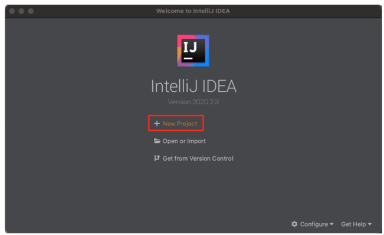
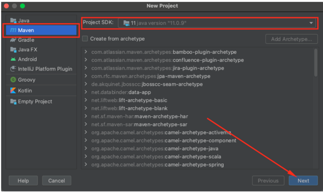
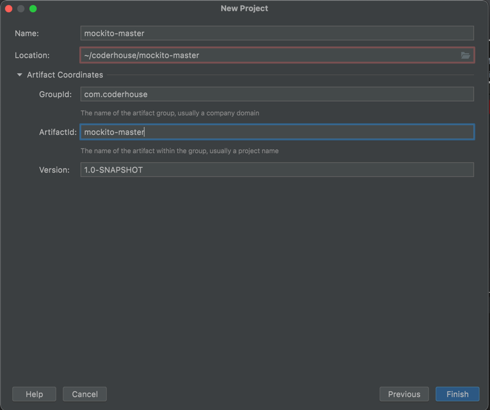
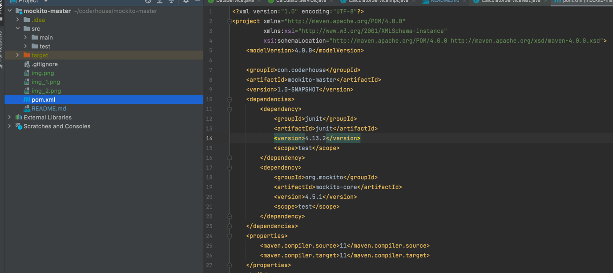
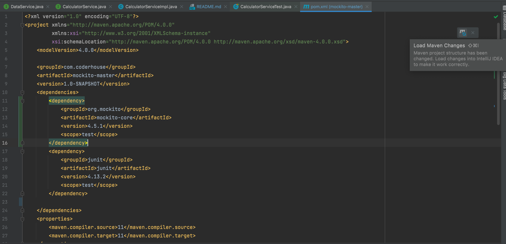

# mockito-master

## Pruebas Unitarias en Java con JUnit – Ejercicio Práctico

Vas a necesitar lo siguiente:

- Un IDE, en mi caso estoy utilizando IntelliJ IDEA.(https://www.jetbrains.com/es-es/idea/)

- Tener instalado OpenJDK 11(https://www.jetbrains.com/es-es/idea/), sin embargo puedes utilizar JDK 8 si lo tienes instalado.

- Opcional: Tener instalado Maven(https://maven.apache.org/).

### Paso 1: Crear un nuevo proyecto Maven en tu IDE

En IntelliJ IDEA hacemos clic en «New Project»

Escogemos la opción Maven, verificamos que esté seleccionada la versión del JDK 11 en «Project SDK» y por último hacemos clic en Siguiente.

Es necesario indicar el nombre del proyecto, la ubicación, group id (en mi caso es com.coderhouse), artifactId(mockito-master) y la versión y hacemos clic en Finalizar.

### Paso 2: Modificar el archivo pom.xml

Luego de haber creado el proyecto es necesario abrir el archivo pom.xml y añadir la version del JDK con la que queremos que compile el proyecto y añadir la dependencia de JUnit.

El archivo pom.xml debe quedar como este:
<pre class="EnlighterJSRAW" data-enlighter-language="xml" data-enlighter-theme="" data-enlighter-highlight="" data-enlighter-linenumbers="" data-enlighter-lineoffset="" data-enlighter-title="" data-enlighter-group="">&lt;?xml version="1.0" encoding="UTF-8"?>
&lt;project xmlns="http://maven.apache.org/POM/4.0.0"
         xmlns:xsi="http://www.w3.org/2001/XMLSchema-instance"
         xsi:schemaLocation="http://maven.apache.org/POM/4.0.0 http://maven.apache.org/xsd/maven-4.0.0.xsd">
    &lt;modelVersion>4.0.0&lt;/modelVersion>

    &lt;groupId>com.coderhouse&lt;/groupId>
    &lt;artifactId>mockito-master&lt;/artifactId>
    &lt;version>1.0-SNAPSHOT&lt;/version>
    &lt;dependencies>
        &lt;dependency>
            &lt;groupId>junit&lt;/groupId>
            &lt;artifactId>junit&lt;/artifactId>
            &lt;version>4.13.2&lt;/version>
            &lt;scope>test&lt;/scope>
        &lt;/dependency>
        &lt;dependency>
            &lt;groupId>org.mockito&lt;/groupId>
            &lt;artifactId>mockito-core&lt;/artifactId>
            &lt;version>4.5.1&lt;/version>
            &lt;scope>test&lt;/scope>
        &lt;/dependency>
    &lt;/dependencies>
    &lt;properties>
        &lt;maven.compiler.source>11&lt;/maven.compiler.source>
        &lt;maven.compiler.target>11&lt;/maven.compiler.target>
    &lt;/properties>
    &lt;build>
        &lt;plugins>
            &lt;plugin>
                &lt;groupId>org.jacoco&lt;/groupId>
                &lt;artifactId>jacoco-maven-plugin&lt;/artifactId>
                &lt;version>0.8.8&lt;/version>
                &lt;executions>
                    &lt;execution>
                        &lt;goals>
                            &lt;goal>prepare-agent&lt;/goal>
                        &lt;/goals>
                    &lt;/execution>
                    &lt;execution>
                        &lt;id>report&lt;/id>
                        &lt;phase>prepare-package&lt;/phase>
                        &lt;goals>
                            &lt;goal>report&lt;/goal>
                        &lt;/goals>
                    &lt;/execution>
                &lt;/executions>
            &lt;/plugin>
        &lt;/plugins>
    &lt;/build>

&lt;/project></pre>

Luego de tener el pom.xml tenemos que aplicar los cambios con Maven para que descargue la dependencia de JUnit de los repositorios de Maven Central:

